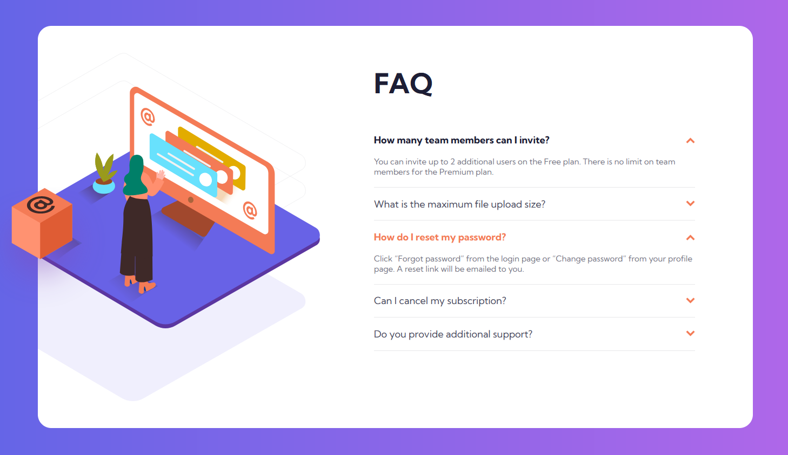

# Frontend Mentor - FAQ Accordion Card

## Overview

In this challange I created an FAQ accordion. An accordion is an interactive section on a webpage that the user can open and close to reveal more content. When opened the revealed content pushes down the rest of the elements on the page. In this instance the user can click on a couple of frequently asked questions to reveal the answers.

[Live Site](https://daniel-papp.github.io/fem-FAQ-accordion-card/)
### Screenshot

### Built with

- HTML 5
- CSS 3
- Sass
- JavaScript

### What I learnt

Although the HTML and JS parts of the project were quiet easy at this point I learned few new CSS tricks such as:
- The advantages of the *mobile first* design principle.
- How to ignore the *overflow: hidden* propertie of a parent element with the help of an extra wrapper [(see here)](http://jsfiddle.net/kv0bLpw8/).
- You can not use transitions on *auto* mesurement values and how to overcome the problem with "max-" properties [(see here)](https://css-tricks.com/using-css-transitions-auto-dimensions/).
- The *!important* CSS property.

This was the first time I used the CSS preprocessor **Sass**. While I have a long way to go with it I familiarized myself with the basic concepts regarding the tool and used some of them in during the project (variables, partials and nesting).
